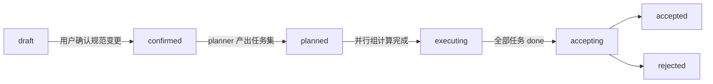
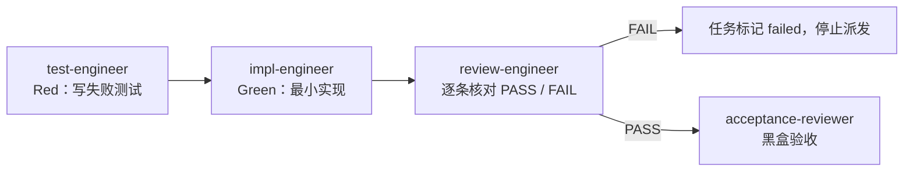

<div align="center">

# pi-spec

**pi 的需求驱动开发流程包**

把「澄清需求 → 规则文件增删改 → 一任务一文件 → 三角色 TDD → 黑盒验收 → PR 前审查」整条链路交给一组分工明确的子代理，主 agent 只负责推进状态与守门。

[](LICENSE)
[](#开发)
[](#安装)
[](package.json)

[安装](#安装) · [快速开始](#快速开始) · [工作流程](#工作流程) · [包内容](#包内容) · [常见问题](#常见问题)

</div>

---

## 这是什么

pi-spec 是一个 [pi](https://github.com/earendil-works/pi) package。安装后，pi 会多出四个斜杠命令、一组流程规则和六个子代理角色，用来把一句话需求推进成经过验收的代码：

- **规范先行（spec-first）**：系统现行行为只存在 `.pi-spec/spec/` 下的规则文件里，一规则一文件；每个需求只是对这些规则文件的一次增删改。
- **三角色 TDD 门禁**：test-engineer 写失败测试、impl-engineer 用最小代码让测试通过、review-engineer 逐条核对可追踪关系。三者串行跑在同一个结构化 workflow 里，verdict 只能是 PASS 或 FAIL，不允许用文本解析放行。
- **黑盒验收**：acceptance-reviewer 不读源码，只按规则文件里的验收条目在真实环境执行并比对输出。
- **决策台账**：AI 和用户的每一个材料性决定都经 `decision_record` 工具写入需求目录，先拿回执再执行。
- **断点续接**：状态只存在 requirements.md 一处，会话中断后 `/spec-resume` 从记录的断点继续。
- **PR 前审查**：pre-reviewer 只读审查分支完整改动，PASS 才允许 push 或开 PR。

## 安装

本包依赖 `@tintinweb/pi-subagents`（0.19.0 及以上）：`Agent`、`SubagentWorkflow`、`StructuredOutput` 三个工具以及 `agents/` 下角色定义的加载都由它提供。两条命令按顺序执行：

```bash
pi install npm:@tintinweb/pi-subagents
pi install git:github.com/0xBB2B/pi-spec
```

本地开发时把第二条换成 `pi install /absolute/path/to/pi-spec`。

每次会话启动时，本包会探测 pi-subagents 是否已加载，缺失时提示上述安装命令。本包不捆绑 pi-subagents：捆绑副本与用户自装的那份会被 pi 当作两个扩展各加载一次，导致同名工具重复注册。

## 快速开始

在任意 git 仓库里打开 pi，按需求类型选择入口：

| 命令 | 用途 |
|---|---|
| `/spec-new <一句话需求>` | 全新需求：澄清 → 规则文件增删改 → 任务拆解 → 并发 TDD → 黑盒验收 |
| `/spec-resume [--verify]` | 从 `.pi-spec` 记录的断点继续未完成的需求 |
| `/spec-revise <问题描述>` | 修 bug / 改已有功能：复现 → 对照现行规范归因 → 路由回需求流程 |
| `/spec-sync [域名 ...]` | 规范与代码对账：黑盒执行验收例子 + 白盒扫描未记录入口，不一致项逐条裁决 |
| `/skill:git-push` | 本地 commit 后调用 pre-reviewer 审查，PASS 才 push 或开 PR |

第一次 `/spec-new` 会在仓库里创建 `.pi-spec/` 目录：

```
<repo>/.pi-spec/
├── .cache/                              临时证据（不提交）
├── spec/
│   ├── INDEX.md                         规则索引，按域分组
│   ├── GLOSSARY.md                      术语唯一权威源
│   └── <域>/<name>.md                   一规则一文件，系统此刻的对外行为
└── requirements/<YYYY-MM-DD>.<slug>/
    ├── requirements.md                  本次变更的背景、目标、触及的规范清单与边界
    ├── tasks/
    │   ├── INDEX.md                     阶段分组、依赖、被否定的备选方案
    │   └── NN-<name>.md                 一任务一文件，自包含
    ├── acceptance.md                    黑盒验收报告
    ├── ai-decisions.jsonl               本需求唯一的 AI 决策事实源
    └── user-decisions.jsonl             本需求唯一的用户决策事实源
```

## 工作流程

每个需求沿一条状态机推进，`status` 只存在 requirements.md frontmatter 一处，只由主 agent 在门禁处推进：



executing 阶段每个任务独立跑一条串行的 TDD 流水线，多个无依赖任务并发：



| 角色 | 产出 | 能做什么 | 不能做什么 |
|---|---|---|---|
| 主 agent | requirements.md、任务运行字段、commit | 推进状态、派工、守门 | 替子代理写测试或实现 |
| planner | tasks/INDEX.md 与 tasks/NN-name.md | 读需求与代码、拆任务 | 改源码、操作 git |
| test-engineer | 结构化 Test 证据 | 写行为测试并确认有意义地失败 | 改生产代码、操作 git |
| impl-engineer | 结构化 Impl 证据 | 最小生产代码让测试通过 | 改测试、加未授权依赖、操作 git |
| review-engineer | PASS / FAIL | 核对需求、验收、Red、Green 的可追踪关系 | 改文件、操作 git |
| acceptance-reviewer | acceptance.md 与严格 JSON 结果 | 真实环境执行验收条目 | 读源码、读任务文件、改代码 |
| pre-reviewer | 结构化提交前审查结果 | 审查分支相对基线的完整改动 | 改文件、操作 git |

## 包内容

| 目录 | 内容 |
|---|---|
| `skills/` | spec-docs（需求包格式）、spec-flow（需求生命周期）、spec-revise（改动与修复归因）、spec-sync（规范与代码对账）、git-commit、git-push |
| `prompts/` | `/spec-new`、`/spec-resume`、`/spec-revise`、`/spec-sync` |
| `agents/` | planner、test-engineer、impl-engineer、review-engineer、acceptance-reviewer、pre-reviewer 子代理定义 |
| `rules/` | 自动注入 system prompt 的流程规则：任务分流、执行授权、递进式澄清、决策记录、审查失败归因 |
| `extensions/rules.ts` | 每轮对话前把 `rules/*.md` 按文件名顺序追加到 system prompt |
| `extensions/agents-bridge.ts` | 会话启动时把 `agents/*.md` 符号链接到 `~/.pi/agent/agents/` |
| `extensions/subagents-preflight.ts` | 会话启动时探测 pi-subagents 是否已加载，缺失时提示安装命令 |
| `extensions/decision-record.ts` | 注册 `decision_record` 工具：经材料性检查把一条 AI 或用户决定追加到需求目录的决策台账并返回回执 |
| `tests/` | 扩展与流程契约的行为测试 |

## 常见问题

**为什么子代理定义要符号链接到全局目录？**
pi package 只能分发 extensions、skills、prompts、themes 四类资源。pi-subagents 只从 `~/.pi/agent/agents/`、项目 `.pi/agents/` 与 `.agents/agents/` 发现子代理定义，不读 package。因此 `agents-bridge.ts` 在每次会话启动时把本包 `agents/` 下的每个定义以符号链接放进全局 agents 目录：

- 目标位置已是指向本包同一文件的链接：跳过。
- 目标位置已有其他文件或链接：不覆盖，会话内给出告警。
- 指向本包但源文件已不存在的旧链接：删除。

**子代理用的模型能换吗？**
各 agent 定义的 `model:` 字段指向作者自己的 provider 别名，安装到其他环境时按本机 provider 调整。

**主 agent 会在没确认的情况下改代码吗？**
不会。注入的执行授权规则要求在写入任何文件前先说明理解、范围与验证方式并取得批准；目标或范围变化时重新取得批准。

**怎么卸载？**
执行 `pi remove <source>`，再删除 `~/.pi/agent/agents/` 下指向本包的链接。

## 开发

```bash
bun install
bun test tests
pi install /absolute/path/to/pi-spec
```

## License

[MIT](LICENSE)
